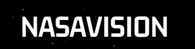
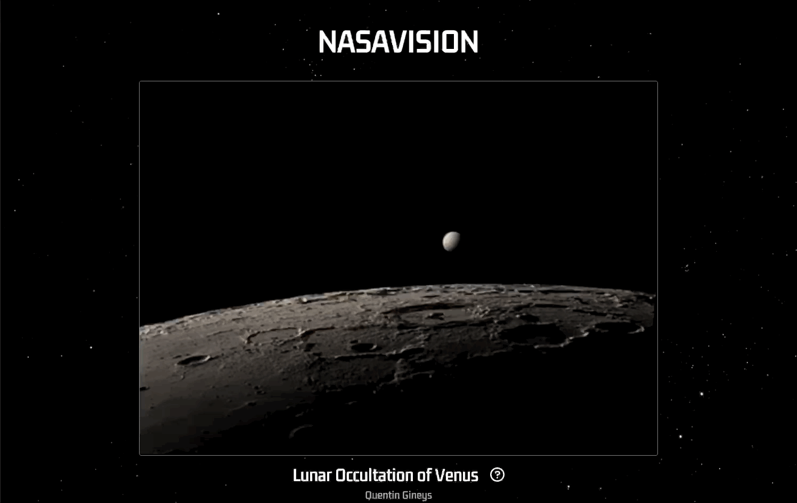

# 

A webpage that utilizes official NASA and other space related API's to provide information about our world, space, and the universe.

* View the space themed photo of the day provided by the official NASA API
* Learn about the earth, the solar system, the universe, and more
* Updates daily with new photo and information

**Try it out here:** [NASAVISION](https://henreth.github.io/nasavision/)

### Developed By:

<a href="https://github.com/henreth" target="_blank" title="henreth">
  
</a>

# Demos:



#
## Technical Accomplishments

* Implemented NASA API to fetch and display space related image and information
* Created dynamic image resizing functionality that updates on demand by user.
* Utilized multiple node packages to display additional information in a user-friendly and visually appealing manner.

**Made With:** 

<a href="https://developer.mozilla.org/en-US/docs/Web/JavaScript" target="_blank" rel="noreferrer">  </a> 
<a href="https://reactjs.org/" target="_blank" rel="noreferrer">  </a> 


</p>

#
## How to Run This Application:
* Run the following commands in two seperate terminals:

```
// install and start the frontend interface
npm install --prefix client
npm start --prefix client 
```
